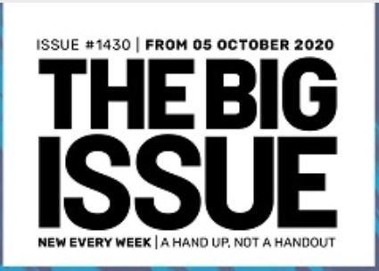
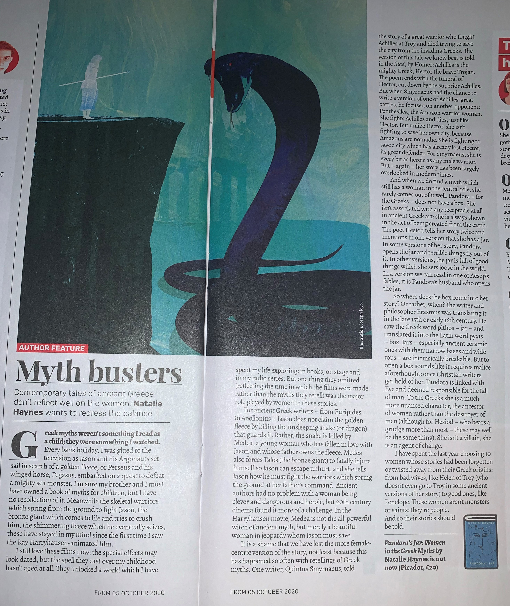

For those (hopefully few) who are unaware, The Big Issue is a charity attempting to assist the homeless by helping foster an income- the sale of a weekly magazines for £3 per copy. The organisation has been running for nearly thirty years, and work hard to make it clear their goal is to be "A Hand Up, Not A Handout".

Their magazine cover logo is very simple: large sans-serif, bold type in all capitals without contrast. It is almost more of a statement than a logo, demanding that people recognise the problem rather than dismiss it or marginalise its victims. Yet despite the intense, upfront nature, the title is an allusion to the problem rather than a declaration of it. Perhaps because the brand and sellers make the problem clear without the need for the title to state it at this point? Or perhaps because the charity wishes for the public to recognise the severity of the issue on their own?

Information around the title is less "confrontational". The lower size and thinner line weight avoid diverting attention from the main title, while remaining in the same typeface to provide a more cohesive design. These details are differentiated within themselves as well. The issue number and tagline are not in bold, unlike the rest of the logo, but remain monospaced despite the different line weight, adding a point of interest without contrasting in a jarring manner.

The traditional logo encapsulates the title of the magazine, as it is almost a replica. There are only two differences: the colour, and the box. A vibrant red replaces the previous black. This could be for two reasons. The first is aesthetic, as the black-and-white will pair better and be more legible on the variety of designs on the magazine covers. The second is to attract attention. A bold red logo is more likely to catch attention due to human colour recognition; red is a danger colour that demands attention. Exactly like the intentions of the charity, drawing attention to the risk homelessness poses to society and its victims.

Within the covers are an assortment of fonts. The main variations are for advertisements, and the subtitles and quotes. The former are paying for the space in the magazine and therefore control how those pages are designed,  down to the typeface in order to represent their ideals rather than *The Big Issue*'s. 

Mostly, though, the text is the body of the articles, which is in a single typeface. This sans-serif font of slightly-greater-than-average x-height is more rounded than many others, giving it a less austere appearance than the more compressed texts used in academic or news materials. Yet it remains a clear font that engages the audience without feeling overly familiar or informal. It strikes the balance between the cheerful novelty fonts used throughout for attention a more traditional text font such as Times New Roman.

Ultimately however, for organisations such as =, regardless of the font and formatting, it is the message in the words and the intent of the organisation that matters the most.