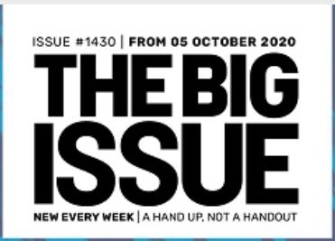

For those (hopefully few) who are unaware, The Big Issue is a charity attempting to assist the homeless by helping foster an income- the sale of their weekly magazines for £3 per copy. The organisation has been running for nearly thirty years, and work hard to make it clear their goal is to be "A Hand Up, Not A Handout".

Their logo is very simple: large sans-serif, bold type in all capitals, with only the issue number and motto in a lighter line weight.