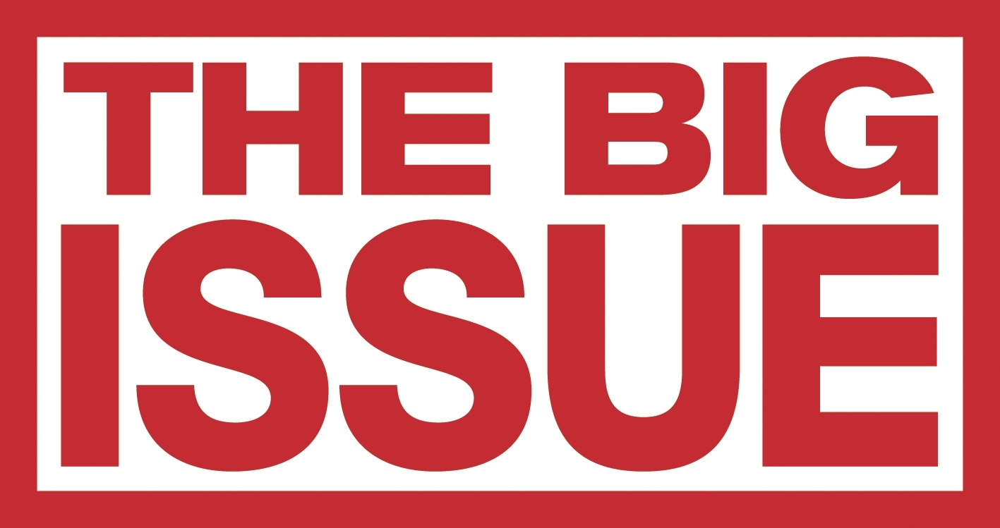

For those (hopefully few) who are unaware, The Big Issue is a charity attempting to assist the homeless by helping foster an income- the sale of a weekly magazines for £3 per copy. The organisation has been running for nearly thirty years, and work hard to make it clear their goal is to be "A Hand Up, Not A Handout".

Their logo is very simple: large sans-serif, bold type in all capitals. It is almost more of a statement than a logo, demanding that people recognise the problem rather than dismiss it or marginalise its victims. Yet despite the intense, upfront nature, the title is an allusion to the problem rather than a declaration of it. Perhaps because the brand and sellers make the problem clear without the need for the title to state it at this point? Or perhaps because the charity wishes for the public to recognise the severity of the issue on their own?