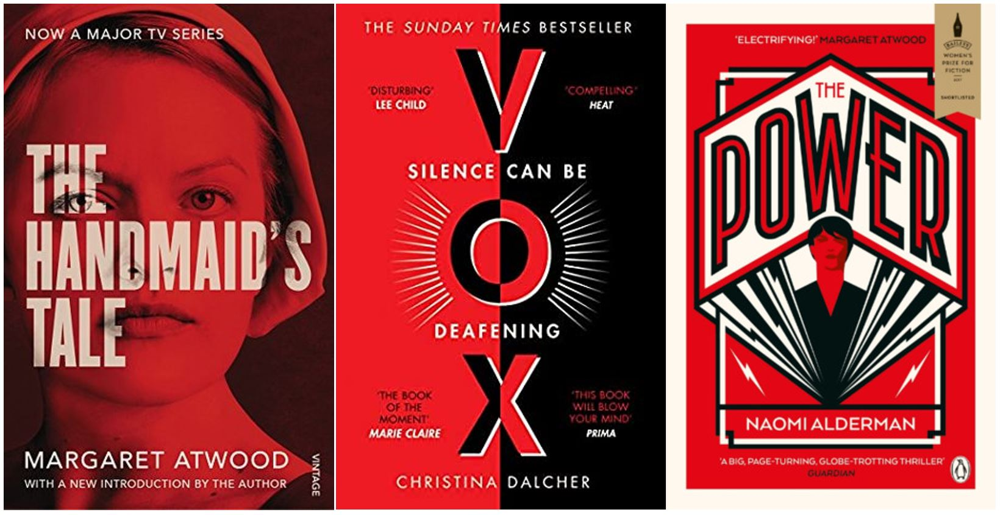

What do these three novels have in common? All three were written by female authors. All three have been on award shortlists. All three are dystopian novels focusing on a dramatically different to our society, thanks to a skew in the scales of gender power. Yet the plots are incredibly different, the authors of different ages and intents. So why are the three so reminiscent of one another?

The three are have "similar" paratextual elements in some regards. In these editions, all have a bold and vivid red colour prominent on them. All focus on the title as a, or the, major element of the cover's layout.

All images courtesy of Goodreads.